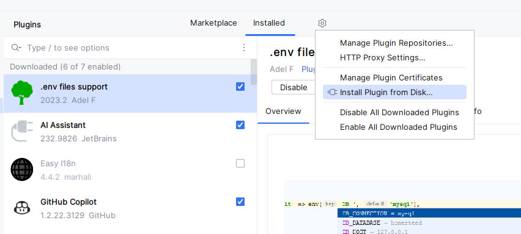
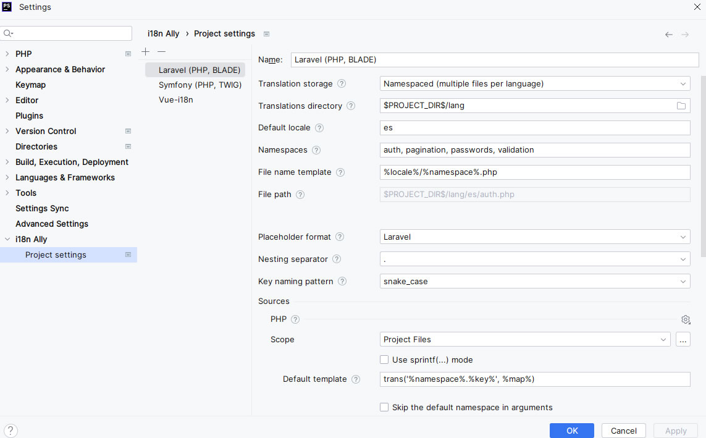

# i18n Ally Plugin

Plugin for i18n intellisense in phpstorm and webstorm & others. with 2024.1.x versions.

## Instructions
1. Download the plugin:
   **jetbrains-ide-plugin_1.4.2.3_support 2024.1.x.zip**

2. Install the plugin manually or from local disk.
   

Open the plugin settings and set the path to the translation files.
   

> NOTE: Tested on Windows 10, with phpstorm 2024.1.x & webstorm 2024.1.x
> this solution is not perfect, but it works. 
> In my case I use it with vue 3 and vue-i18n-next.
